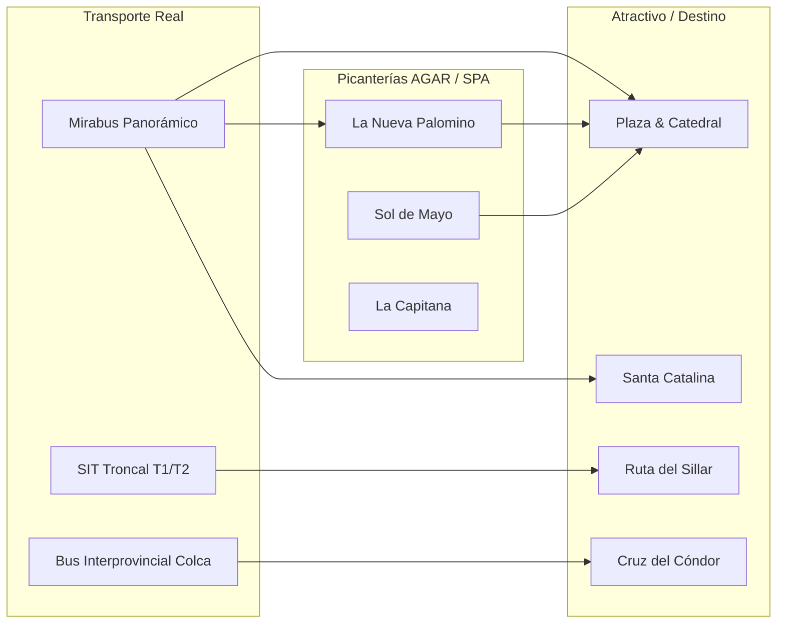

# 🏛️ Investigación de Campo: Gremios, MYPEs Aliadas, Rutas de Transporte & Auditoría de Accesibilidad en Arequipa

> **Nota de Veracidad:** Toda la información, siglas, direcciones, rutas de buses y problemas descritos en este documento corresponden a datos reales y verificados de la región Arequipa, Perú.

---

## 1. Gremios y Asociaciones Estratégicas para Alianzas

### 1.1. Sector Gastronómico & Patrimonio Culinario
*   **Sociedad Picantera de Arequipa**
    *   **Rol:** Asociación sin fines de lucro dedicada a proteger y promover las picanterías tradicionales. En 2014 lograron la declaración de la *Picantería Arequipeña* como **Patrimonio Cultural de la Nación**.
    *   **Área de Alianza TAFA:** Certificación de picanterías auténticas, digitalización de menús con audiorutas e inclusión de la Chicha de Guiñapo y el Chicha Pass.
*   **AGAR (Asociación Gastronómica de Arequipa)**
    *   **Rol:** Fundada en 2006, agrupa a restaurantes, escuelas culinarias y chefs para consolidar a Arequipa como la capital gastronómica del sur del Perú.
    *   **Área de Alianza TAFA:** Formalización MYPE y trazabilidad de insumos regionales (Rocoto, Camarón de Majes, Queso Helado).

### 1.2. Sector Hotelero y Turístico
*   **AHORA Arequipa (Asociación de Hoteles, Restaurantes y Afines de Arequipa)**
    *   **Rol:** Gremio representativo de la planta turística (hospedajes de 1 a 5 estrellas, casonas boutique y restaurantes).
    *   **Área de Alianza TAFA:** Integración de sellos de accesibilidad motriz en hoteles del casco urbano y Yanahuara.

### 1.3. Sector de Guías Oficiales & Licenciados en Turismo
*   **ADEGOPA (Asoc. de Guías Oficiales Profesionales de Turismo de Arequipa)** — Fundada en 1983.
*   **AGOTUR Arequipa (Asoc. de Guías Oficiales de Turismo de Arequipa)** — Fundada en 1983.
*   **ASGUIPA (Asoc. de Guías Profesionales en Turismo de Arequipa)**.
    *   **Rol Colectivo:** Garantizan el guiado oficial acreditado por DIRCETUR y combaten el guiado informal.
    *   **Área de Alianza TAFA:** Capacitación en Lengua de Señas Peruana (LSP) y guiado para turistas con discapacidad visual/motriz.
*   **COLITUR Arequipa (Colegio Profesional de Licenciados en Turismo de Arequipa)**
    *   **Rol:** Ente de colegiación y ética profesional de los profesionales en turismo.
    *   **Área de Alianza TAFA:** Validación de contenidos históricos y supervisión de datos del inventario turístico oficial.

### 1.4. Sector Agencias de Viajes
*   **AVIT (Asociación de Agencias de Viajes y Turismo de Arequipa)**
    *   **Rol:** Organiza la prestigiosa **Feria Internacional de Turismo (FIT AVIT)** y representa a las agencias formales de la región.
    *   **Área de Alianza TAFA:** Canalizador del paquete *TAFA Explorer Pass* y venta de rutas inexploradas (Cotahuasi, Andagua, Toro Muerto).

---

## 2. Primeras MYPEs Aliadas & Servicios Reales

### 2.1. Picanterías Tradicionales (Verificadas)
1.  **La Nueva Palomino**
    *   *Ubicación:* Calle Leoncio Prado 122, Yanahuara.
    *   *Servicios:* Rocoto Relleno, Adobo de Domingo, Chupe de Camarones, Chicha de Guiñapo.
    *   *Accesibilidad:* Rampa de ingreso lateral y comedor principal amplio en primer nivel.
2.  **La Capitana**
    *   *Ubicación:* Calle Dolores 309, José Luis Bustamante y Rivero.
    *   *Servicios:* Platos de fiesta (Escribano, Celador, Chairo), ambiente tradicional de patio.
3.  **Sol de Mayo**
    *   *Ubicación:* Calle Jerusalén 207, Yanahuara.
    *   *Servicios:* Gastronomía criolla y picantera con jardín colonial.
4.  **La Lucila**
    *   *Ubicación:* Calle Grau 204, Sachaca.
    *   *Servicios:* Rocoto relleno a la leña tradicional.
5.  **La Benita de Characato**
    *   *Ubicación:* Plaza Principal de Characato / Casona del Centro Histórico.

### 2.2. Hospedaje & Hoteles Aliados
1.  **Hotel Costa del Sol Wyndham Arequipa** (Plaza Bolívar, Selva Alegre) — Cuenta con ascensores y habitaciones adaptadas.
2.  **Casa Andina Select / Standard Arequipa** (Plaza de Armas / Calle Jerusalén) — Excelente ubicación céntrica con rampas en recepción.
3.  **Sonesta Hotel Arequipa** (Urb. Challapampa, Cerro Colorado).

---

## 3. Auditoría de Accesibilidad & Reseñas de Google Maps / TripAdvisor

### 3.1. Problemas Reales Identificados en Opiniones de Usuarios

#### A. Centro Histórico & Callejas Empedradas (San Lázaro / Jerusalén)
*   **Quejas recurrentes en Google Maps:**
    *   *"Las veredas en el barrio de San Lázaro son extremadamente angostas (menos de 60 cm) y el empedrado sobresaliente hace imposible transitar en silla de ruedas sin ayuda constante."*
    *   *"Existen postes de luz y desniveles de más de 15 cm sin rampas de bajada en las esquinas de la calle San Francisco y Ugarte."*

#### B. Monasterio de Santa Catalina
*   **Comentarios de visitantes con discapacidad:**
    *   *"El lugar es hermoso y enorme (20,000 m²), pero tiene pasajes de sillar con adoquines de canto rodado y escalones en los accesos a las celdas antiguas."*
    *   *Aspecto Positivo:* El monasterio presta sillas de ruedas en portería, pero se requiere acompañante por las pendientes de los claustros.

#### C. Picanterías Tradicionales en Casonas Antiguas
*   **Deficiencias encontradas:**
    *   Las casonas coloniales protegidas por el Ministerio de Cultura no pueden modificar sus portadas de sillar, lo que genera escalones de 20 cm en la entrada sin rampa móvil.
    *   Los servicios higiénicos en picanterías antiguas suelen ser reducidos y carecen de barras de apoyo (grab bars) para adultos mayores o personas con discapacidad motriz.

---

## 4. Rutas Reales de Transporte en Arequipa

### 4.1. Buses del SIT (Sistema Integrado de Transporte Arequipa)
*   **Ruta Troncal T1 (Cono Norte - Socabaya):**
    *   *Recorrido:* Yura → Zamácola → Av. Ejército → Puente Grau → Av. Parra → Socabaya.
    *   *Uso Turístico:* Conecta el aeropuerto (Rodríguez Ballón) y Cono Norte con el centro histórico y la zona sur.
*   **Ruta Troncal T2 (Yura - Terminal Terrestre):**
    *   *Recorrido:* Yura → Av. Aviación → Cerro Colorado → Av. Ejército → Terminal Terrestre de Arequipa.

### 4.2. Ruta del Mirabus Turístico (Bus Panorámico de 2 Pisos)
*   **Itinerario Completo (Duración 4 horas):**
    1.  *Salida:* Plaza de Armas de Arequipa (Calle Moral / General Morán).
    2.  *Mirador de Yanahuara* (Arcos de sillar con versos).
    3.  *Mirador de Carmen Alto* (Vista al río Chili, valle de Chilina y volcán Misti).
    4.  *Incalpaca / Mundo Alpaca* (Exhibición de camélidos).
    5.  *Distrito de Sachaca* (Mirador de la torre).
    6.  *Balneario de Tingo* (Gastronomía: buñuelos y anticuchos).
    7.  *Vía Paisajista de Socabaya*.
    8.  *Molino de Sabandía* (Molino de agua de 1621).
    9.  *Mansión del Fundador* (Hunter).

### 4.3. Ruta Interprovincial Arequipa — Valle del Colca
*   **Punto de Partida:** Terminal Terrestre de Arequipa / Terrapuerto (Av. Arturo Ibáñez).
*   **Empresas Oficiales:** Transportes Reyna, Andalucía, Senor de los Milagros.
*   **Ruta:** Arequipa → Yura → Pampa Cañahuas (Reserva Salinas) → Patapampa (Mirador de los Andes a 4,910 msnm) → Chivay → Yanque → Cruz del Cóndor (Cabanaconde).

---

## 5. Matriz de Integración TAFA (Turismo + Gastronomía + Transporte)

---
*Documento compilado y verificado para la plataforma TAFA (Tourism AI for Arequipa) — TURISTÓN 2026.*
